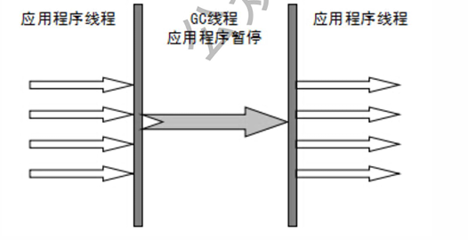

# 常见的垃圾回收器有那些


如果说收集算法是内存回收的方法论，那么垃圾收集器就是内存回收的具体实现。 虽然我们对各个收集器进行比较，但并非要挑选出一个最好的收集器。因为知道现在为止还没有最好的 垃圾收集器出现，更加没有万能的垃圾收集器，我们能做的就是根据具体应用场景选择适合自己的垃圾 收集器。试想一下：如果有一种四海之内、任何场景下都适用的 邑器存在，那么我们的HotSpot 虚拟机就不会实现那么多不同的垃圾收集器了。

### Serial收集器

Serial （串行）收集器收集器是最基本、历史最悠久的垃圾收集器了。大家看名字就知道这个收集器是 一个单线程收集器了。它的"单线程"的意义不仅仅意味着它只会使用一条垃圾收集线程去完成垃圾收 集工作，更重要的是它在进行垃圾收集工作的时间的时候暂停其他所有的工作线程（"Stop The World” ）, 直到它收集结束。

新生代采用应用程序线程复制应用程序线程，老年代采用标记-整理算法。



虚拟机的设计者们当然知道Stop The World带来的不良用户体验，所以在后续的垃圾收集器设计中停顿 时间在不断缩短（仍然还有停顿，寻找最优秀的垃圾收集器的过程仍然在继续）。 但是Serial收集器有没有优于其他垃圾收集器的地方呢？当然有，它简单而高效（与其他收集器的单线 程相比）。Serial收集器由于没有线程交互的开销，自然可以获得很高的单线程收集效率。Serial收集器 对于运行在Client模式下的虚拟机来说是个不错的选择。

### ParNew收集器

ParNew收集器其实就是Serial收集器的多线程版本，除了使用多线程进行垃圾收集外，其余行为（控制 参数、收集算法、回收策略等等）和Serial收集器完全一样。


它是许多运行在Server模式下的虚拟机的首要选择，除了Serial收集 正意义上的并发收集器，后面会介绍到）配合工作。 并行和并发概念补充:

* 并 行 （Parallel） :指多条垃圾收集线程并行工作，但此时用户线程仍然处于等待状态。
* 并 发 （Concurrent） : 指用户线程与垃圾收集线聲岡占砂亍（但不一定是并行，可能会交替执行）， 用户程序在继续运行，而垃圾收集器运行在另7 吨 上 。

### Parallel Scavenge收集器

ParallelScavenge收集器类似于收集器。那么它有什么特别之处呢?

```text
-XX:+UseParallelGC
使用Parallel收集器+老年代串行
-XX:+UseParallelOldGC
使用Parallel收集器+老年代并行
```

Parallel Scavenge收集器关注点是吞吐量（高效率的利用CPU） 。CMS等垃圾收集器的关注点更多的 是用户线程的停顿时间（提高用户体验）。所谓吞吐量就是CPU中用于运行用户代码的时间与CPU总消 耗时间的比值。Parallel Scavenge收集器提供了很多参数供用户找到最合适的停顿时间或最大吞吐量， 如果对于收集器运作不太了解的话，手工优化存在的话可以选择把内存管理优化交给虚拟机去完成也是 一个不错的选择。

### Serial Old收集器

Serial收集器的老年代版本，它同样是一个单线程收集器。它主要有两种用途：一种用途是在JDK1.5以 及以前的版本中与Parallel Scavenge收集器搭配使用，另 一 种 用 途 是 收 集 器 的 后 备 方 案 。

### Parallel Old收集器

Parallel Scavenge收集器的老年代版本。使用多线程和〃标记-整理〃算法。在注重吞吐量以及CPU资源 的场合，都可以优先考虑Parallel Scavenge收集器和Parallel Old收集器。

### CMS收集器

CMS \(Concurrent Mark Sw eep\)收集器是一种以获取最短回收停顿时间为目标的收集器。它而非常符合在注重用户体验的应用上使用。

CMS \(Concurrent Mark Sweep\) 收集器是HotSpot虚拟机第一款真正意义上的并发收集器，它第一次实现了让垃圾收集线程与用户线程\(基本上\)同时工作。

从名字中的Mark Sweep这两个词可以看出，CMS收集器是一种“标记-清除”算法实现的，它的运作过程相比于前面几种垃圾收集器来说更加复杂一些。整个过程分为四个步骤：

* 初始标记：暂停所有的其他线程，并记录下直接与root相连的对象，速度很快； 
* 并发标记：同时开启GC和用户线程，用一个闭包结构去记录可达对象。但在这个阶段结束，这个闭 包结构并不能保证包含当前所有的可达对象。因为用户线程可能会不断的更新引用域，所以GC线程 无法保证可达性分析的实时性。所以这个算法里会跟踪记录这些发生引用更新的地方。 
* 重新标记：重新标记阶段就是为了修正并发标记期间因为用户程序继续运行而导致标记产生变动的 那一部分对象的标记记录，这个阶段的停顿时间一般会比初始标记阶段的时间稍长，远远比并发标记 阶段时间短 
* 并发清除：开启用户线程，同时GC线程开始对为标记的区域做清扫。


从它的名字就可以看出它是一款优秀的垃圾收集器，主要优点：并发收集、低停顿。但是它有下面三个 明显的缺点： 

* 对CPU资源敏感； 
* 无法处理浮动垃圾； 
* 它使用的回收算法-"标记-清除"算法会导致收集结束时会有大量空间碎片产生

### G1收集器

G1 （Garbage-First）是一款面向服务器的垃圾收集器，主要针对配备多颗处理器及大容量内存的机器•以极 高概率满足GC停顿时间要求的同时，还具备高吞吐量性能特征.被视为JDK1.7中HotSpot虚拟机的一个重要进化特征。它具备一下特点：

* 并行与并发：G1能充分利用CPU、多核环境下的硬件优势，使用多个CPU （CPU或者CPU核心）来 缩短Stop-The-World停顿时间。部分其他收集器原本需要停顿Java线程执行的GC动作，G1收集器仍 然可以通过并发的方式让jaw程 执 行 。 
* 分代收集：虽然G1可以\*需緊其他收集器配合就能独立管理整个GC堆，但是还是保留了分代的概 念。 
* 空间整合：与CMS的"标记--清理"算法不同，G1从整体来看是基于"标记整理"算法实现的收集器；从 局部上来看是基于"复制"算法实现的。 
* 可预测的停顿：这是G1相对于CMS的另一个大优势，降低停顿时间是G1和 CMS共同的关注点，但 G1除了追求低停顿外，还能建立可预测的停顿时间模型，能让使用者明确指定在一个长度为M毫秒 的时间片段内。

G1收集器的运作大致分为以下几个步骤:

* 初始标记
* 并发标记 
* 最终标记
* 筛选回收

G1收集器在后台维护了一个优先列表，每次根据允许的收集时间，优先选择回收价值最大的Region（这 也就是它的名字Garbage-First的由来）。这种使用Region划分内存空间以及有优先级的区域回收方式， 保证了GF收集器在有限时间内可以尽可能高的收集效率（把内存化整为零）。


