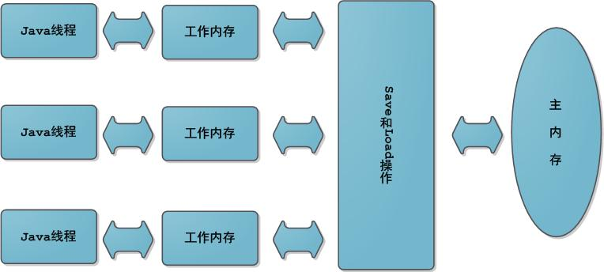
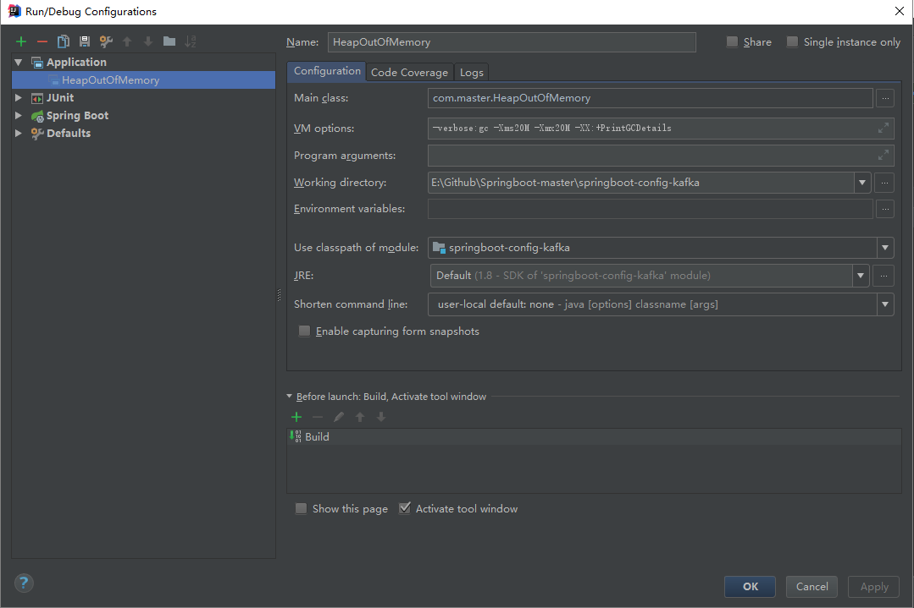

# JVM内存模型

**定义**

Java虚拟机规范中试图定义一种Java内存模型 \\[1\\] （Java Memory Model,JMM）来屏蔽掉各种硬件和操作系统的内存访问差异，以实现让Java程序在各种平台下都能达到一致的内存访问效果。在此之前，主流程序语言（如C/C++等）直接使用物理硬件和操作系统的内存模型，因此，会由于不同平台上内存模型的差异，有可能导致程序在一套平台上并发完全正常，而在另外一套平台上并发访问却经常出错，因此在某些场景就必须针对不同的平台来编写程序。

定义Java内存模型并非一件容易的事情，这个模型必须定义得足够严谨，才能让Java的并发内存访问操作不会产生歧义；但是，也必须定义得足够宽松，使得虚拟机的实现有足够的自由空间去利用硬件的各种特性（寄存器、高速缓存和指令集中某些特有的指令）来获取更好的执行速度。经过长时间的验证和修补，在JDK 1.5（实现了JSR-133 \\[2\\] ）发布后，Java内存模型已经成熟和完善起来了。

**主内存与工作内存**

Java内存模型的主要目标是定义程序中各个变量的访问规则，即在虚拟机中将变量存储到内存和从内存中取出变量这样底层细节。此处的变量与Java编程时所说的变量不一样，指包括了实例字段、静态字段和构成数组对象的元素，但是不包括局部变量与方法参数，后者是线程私有的，不会被共享。

Java内存模型中规定了所有的变量都存储在主内存中，每条线程还有自己的工作内存（可以与前面将的处理器的高速缓存类比），线程的工作内存中保存了该线程使用到的变量到主内存副本拷贝，线程对变量的所有操作（读取、赋值）都必须在工作内存中进行，而不能直接读写主内存中的变量。不同线程之间无法直接访问对方工作内存中的变量，线程间变量值的传递均需要在主内存来完成，线程、主内存和工作内存的交互关系如下图所示：



**内存间交互操作**

关于主内存与工作内存之间的具体交互协议，即一个变量如何从主内存拷贝到工作内存、如何从工作内存同步到主内存之间的实现细节，Java内存模型定义了以下八种操作来完成：

* lock（锁定）：作用于主内存的变量，把一个变量标识为一条线程独占状态。
* unlock（解锁）：作用于主内存变量，把一个处于锁定状态的变量释放出来，释放后的变量才可以被其他线程锁定。
* read（读取）：作用于主内存变量，把一个变量值从主内存传输到线程的工作内存中，以便随后的load动作使用
* load（载入）：作用于工作内存的变量，它把read操作从主内存中得到的变量值放入工作内存的变量副本中。
* use（使用）：作用于工作内存的变量，把工作内存中的一个变量值传递给执行引擎，每当虚拟机遇到一个需要使用变量的值的字节码指令时将会执行这个操作。
* assign（赋值）：作用于工作内存的变量，它把一个从执行引擎接收到的值赋值给工作内存的变量，每当虚拟机遇到一个给变量赋值的字节码指令时执行这个操作。
* store（存储）：作用于工作内存的变量，把工作内存中的一个变量的值传送到主内存中，以便随后的write的操作。
* write（写入）：作用于主内存的变量，它把store操作从工作内存中一个变量的值传送到主内存的变量中。

如果要把一个变量从主内存中复制到工作内存，就需要按顺寻地执行read和load操作，如果把变量从工作内存中同步回主内存中，就要按顺序地执行store和write操作。Java内存模型只要求上述操作必须按顺序执行，而没有保证必须是连续执行。也就是read和load之间，store和write之间是可以插入其他指令的，如对主内存中的变量a、b进行访问时，可能的顺序是read a，read b，load b， load a。Java内存模型还规定了在执行上述八种基本操作时，必须满足如下规则：

* 不允许read和load、store和write操作之一单独出现
* 不允许一个线程丢弃它的最近assign的操作，即变量在工作内存中改变了之后必须同步到主内存中。
* 不允许一个线程无原因地（没有发生过任何assign操作）把数据从工作内存同步回主内存中。
* 一个新的变量只能在主内存中诞生，不允许在工作内存中直接使用一个未被初始化（load或assign）的变量。即就是对一个变量实施use和store操作之前，必须先执行过了assign和load操作。
* 一个变量在同一时刻只允许一条线程对其进行lock操作，lock和unlock必须成对出现
* 如果对一个变量执行lock操作，将会清空工作内存中此变量的值，在执行引擎使用这个变量前需要重新执行load或assign操作初始化变量的值
* 如果一个变量事先没有被lock操作锁定，则不允许对它执行unlock操作；也不允许去unlock一个被其他线程锁定的变量。
* 对一个变量执行unlock操作之前，必须先把此变量同步到主内存中（执行store和write操作）。

### Java内存区域（运行时数据区）

Java虚拟机在执行Java程序的过程中会把它管理的内存划分成若干个不同的数据区域。JDK1.8和之前的版本略有不同、下面会介绍到。

**JDK 1.8 之前:**


**JDK1.8：**


**线程私有的：**

* 程序计数器
* 虚拟机栈
* 本地方法栈

**线程共享的：**

* 堆
* 方法区
* 直接内存（非运行时数据区的一部分）

#### 程序计数器 

程序计数器是一块较小的内存空间，可以看作是当前线程所执行的字节码的行号指示器。字节码解释器 工作时通过改变这个计数器的值来选取下一条需要执行的字节码指令，分支、循环、跳转、异常处理、 线程恢复等功能都需要依赖这个计数器来完。 另外，为了线程切换后能恢复到正确的执行位置，每条线程都需要有一个独立的程序计数器，各线程之 间计数器互不影响，独立存储，我们称这类内存区域为"线程私有"的内存。 从上面的介绍中我们知道程序计数器主要有两个作用:

1. 字节码解释器通过改变程序计数器来依次读取指令，从而实现代码的流程控制，如：顺序执行、选 择、循环、异常处理。 
2. 在多线程的情况下，程序计数器用于记录当前线程执行的位置，从而当线程被切换回来的时候能够知 道该线程上次运行到哪儿了。 

> 注意：程序计数器是唯一一个不会岀现OutOfMemoryError的内存区域，它的生命周期随着线程的创 建而创建，随着线程的结束而死亡。

#### Java虚拟机栈 

与程序计数器一样，Java虚拟机栈也是线程私有的，它的生命周期和线程相同，描述的是Java方法执 行的内存模型，每次方法调用的数据都是通过栈传递的。 Java内存可以粗糙的区分为堆内存（Heap）和栈内存（Stack）,其中栈就是现在说的虚拟机栈，或者说是 虚拟机栈中局部变量表部分。 （实际上，Java虚拟机栈是由一个个栈帧组成，而每个栈帧中都拥有：局部变量表、操作数栈、动态链接、方法出口信息。） 局部变量表主要存放了编译器可知的各种数据类型（boolean、byte、char、short、int、float、long、 double） , 对象引用（reference类型，它不同于对象本身，可能是一个指向对象起始地址的引用指针, 也可能是指向一个代表对象的句柄或其他与此对象相关的位置）。 

Java 虚拟机栈会出现两种异常：StackOverFlowError 和 OutOfMemoryError。 

* StackOverFlowError: 若Java虚拟机栈的内存大小不允许动态扩展，那么当线程请求栈的深度超过 当前Java虚拟机栈的最大深度的时候，就拋出StackOverFlowError异常。
* OutOfMemoryError: 若 Java虚拟机栈的内存大小允许动态扩展，且当线程请求栈时内存用完了， 无法再动态扩展了，此时拋出OutOfMemoryError异常

Java虚拟机栈也是线程私有的，每个线程都有各自的Java虚拟机栈，而且随着线程的创建而创建，随着线程死亡而死亡

扩展：那么方法/函数如何调用？

Java栈可用类比数据结构中栈，Java栈中保存的主要内容是栈帧，每一次函数调用都会有一个对应的栈 帧被压入Java栈，每一个函数调用结束后，都会有一个栈帧被弹出。 

Java方法有两种返回方式:

1. return 语句。 
2. 拋出异常。

 不管哪种返回方式都会导致栈帧被弹出

#### 本地方法栈 

和虚拟机栈所发挥的作用非常相似，区别是：虚拟机栈为虚拟机执行Java方 法 （也就是字节码）服 务，而本地方法栈则为虚拟机使用到的Native方法服务。在 HotSpot虚拟机中和Java虚拟机栈合二 为一。 本地方法被执行的时候，在本地方法栈也会创建一个栈帧.用于存放该本地方法的局部变量表、操作数栈、动态链接、出口信息。 方法执行完毕后相应的栈帧也会出栈并释放内存空间 , 也会出现StackOverFlowError和 OutOfMemoryError 两种异常。

#### 堆 

Java虚拟机所管理的内存中最大的一块，Java堆是所有线程共享的一块内存区域，在虚拟机启动时创建。此内存区域的唯一目的就是存放对象实例，几乎所有的对象实例以及数组都在这里分配内存。 Java堆是垃圾收集器管理的主要区域，因此也被称作GC堆 （Garbage Collected Heap） 从垃圾回收的角度，由于现在收集器基本都采用分代垃圾收集算法，所以Java堆还可以细分为：新生代和老年代：再细致一点有：Eden空间、From Survivor、To Survivor空间等。进一步划分的目的是更好地回收内存， 或者更快地分配内存。


上图所示的eden区、sO区、si区都属于新生代，tentired区属于老年代。大部分情况，对象都会首先在 Eden区域分配，在一次新生代垃圾回收后，如果对象还存活，则会进入sO或者s i ,并且对象的年龄还 会加l（Eden区-&gt;Survivor区后对象的初始年龄变为1）, 当它的年龄增加到一定程度（默认为15岁），就 会被晋升到老年代中。对象晋升到老年代的年龄阈值，可以通过参数-XX:MaxTenuringThreshold来 设置。

#### 方法区 

方法区与Java堆一样，是各个线程共享的内存区域，它用于存储已被虚拟机加载的类信息、常量、静 态变量、即时编译器编译后的代码等数据。虽然Java虚拟机规范把方法区描述为堆的一个逻辑部分，但 是它却有一个别名叫做Non-Heap （非堆），目的应该是与Java堆区分开来。 方法区也被称为永久代。很多人都会分不清方法区和永久代的关系，为此我也查阅了文献。 

方法区和永久代的关系

> 《Java虚拟机规范》只是规定了有方法区这么个概念和它的作用，并没有规定如何去实现它。那 么，在不同的JVM 上方法区的实现肯定是不同的了。方法区和永久代的关系很像Java中接口和类 的关系，类实现了接口、而永久代就是HotSpot虚拟机对虚拟机规范中方法区的一种实现方式。也 就是说，永 久 代 是 HotSpot概念 ，方法区是Java虚拟机规范中的定义，是一种规范，而永久代是 一种实现，一个是标准一个是实现，其他的虚拟机实现并没有永久带这一说法。

常用参数 

JDK 1.8之前永久代还没被彻底移除的时候通常通过下面这些参数来调节方法区大小

```text
-XX: PermSize=N //方法区（永久代）初始大小
-XX:MaxPermSize=N //方法区（永久代）最大大小，超过这个值将会抛出OutOfMemoryErroi-异 常：java.lang.OutOfM em oryError: PermGen
```

相对而言，垃圾收集行为在这个区域是比较少出现的，但并非数据进入方法区后就"永久存在"了。\*\* JDK 1.8的时候，方 法 区 （HotSpot的永久代）被彻底移除了（JDK1.7就已经开始了），取而代之是元空 间，元空间使用的是直接内存。

下面是一些常用参数:

```text
-XX:MetaspaceSize=N //设置Metaspace的初始（和最小大小） 
-XX:MaxMetaspaceSize=N //设置Metaspace的最大大小
```

与永久代很大的不同就是，如果不指定大小的话，随着更多类的创建，虚拟机会耗尽所有可用的系统内 存。 为什么要将永久代\(PermGen\)替换为元空间\(MetaSpace\)呢？ 整个永久代有一个JVM本身设置固定大小上线，无法进行调整，而元空间使用的是直接内存，受本机 可 用 内 存 的 限 制 ，并 且 永 远 不 会 得 到 java.lang.OutOfMemoryError **。** 你 可 以 使 用 -XX : MaxMetaspaceSize标志设置最大元空间大小，默认值为unlimited, 这意味着它只受系统内存的限 制。- XX：MetaspaceSize调整标志定义元空间的初始大小如果未指定此标志，则 Metaspace将根据运 行时的应用程序需求动态地重新调整大小。 当然这只是其中一个原因，还有很多底层的原因，这里就不提了。

#### 运行时常量池 

运行时常量池是方法区的一部分。Class文件中除了有类的版本、字段、方法 、接口等描述信息外，还有常量池信息\(用于存放编译期生成的各种字面量和符号引用\) 既然运行时常量池时方法区的一部分，自然受到方法区内存的限制，当常量池无法再申请到内存时会拋 出 OutOfMemoryError 异常。 JDK1.7及之后版本的JVM已经将运行时常量池从方法区中移了岀来，在 Java堆 \(Heap\)中开辟了一 块区域存放运行时常量池。


#### 直接内存 

直接内存并不是虚拟机运行时数据区的一部分，也不是虚拟机规范中定义的内存区域，但是这部分内存 也被频繁地使用。而且也可能导致OutOfMemoryError异常岀现。

JDK1.4中 新 加 入 的 NIO（New Input/Output）类 ，引 入 了 一 种 基 于 通 道 （Channel） 与缓存区 （Buffer） 的 I/O 方式，它可以直接使用Native函数库直接分配堆外内存，然后通过一个存储在Java 堆中的DirectByteBuffer对象作为这块内存的引用进行操作。这样就能在一些场景中显著提高性能，因 为避免了在Java堆和Native堆之间来回复制数据。

本机直接内存的分配不会收到Java堆的限制，但是，既然是内存就会受到本机总内存大小以及处理器 寻址空间的限制。

#### 说一下Java对象的创建过程 

下图便是Java对象的创建过程，我建议最好是能默写出来，并且要掌握每一步在做什么。


① 类加载检查：虚拟机遇到一条new指令时，首先将去楡查迭个指令的参数是否能在常量池中定位到 这个类的符号引用，并 且 检 查 这 个 符 号 引 用 代 表 的 类 是 否 解 析 和 初 始 化 过 。如果没有，那 必须先执行相应的类加载过程。 

② 分配内存：在类加载检查通过后，接下来虚电机将为新生对象分配内存。对象所需的内存大小在类加 载完成后便可确定，为对象分配空间的任务等同于把一块确定大小的内存从Java堆中划分出来。分配 方式有"指针碰撞"和"空闲列表"两种分择那种分配方式由Java堆是否规整决定，而Java堆是否规 整又由所采用的垃圾收集器是否带有压缩整理功能决定。

内存分配的两种方式： （补充内剧!需要掌握） 

选择以上两种方式中的哪一种，取决于Java堆内存是否规整。而 Java堆内存是否规整，取决于GC收 集器的算法是”标记-清除”，还是标记-整理”（也称作”标记-压缩”），值得注意的是，复制算法内存也是 规整的


内存分配并发问题（补充内容，需要掌握） 

在创建对象的时候有一个很重要的问题，就是线程安全，因为在实际开发过程中，创建对象是很频繁的 事情，作为虚拟机来说，必须要保证线程是安全的，通常来讲，虚拟机采用两种方式来保证线程安全： 

* CAS+失败重试：CAS是乐观锁的一种实现方式。所谓乐观锁就是，每次不加锁而是假设没有冲突 而去完成某项操作，如果因为冲突失败就重试，直到成功为止。虚拟机采用CAS配上失败重试的方式保证更新操作的原子性。 
* TLAB：为每一个线程预先在Eden区分配一块儿内存，JVM在给线程中的对象分配内存时.首先在 TLAB分配，当对象大于TLAB中的剩余内存或TLAB的内存已用尽时，再采用上述的CAS进行内存分配。

③ 初始化零值：内存分配完成后，虚拟机需要将分配到的内存空间都初始化为零值（不包括对象头）， 这一步操作保证了对象的实例字段在Java代码中可以不赋初始值就直接使用，程序能访问到这些字段 的数据类型所对应的零值。 

④ 设置对象头：初始化零值完成之后，虚拟机要对对象进行必要的设置，例如这个对象是那个类的实 例、如何才能找到类的元数据信息、对象的哈希吗、对象的GC分代年龄等信息。这些信息存放在对象 头中。另外，根据虚拟机当前运行状态的不同，如是否启用偏向锁等，对象头会有不同的设置方式。 

⑤ 执行init方法：在上面工作都完成之后，从虚拟机的视角来看，一个新的对象已经产生了，但从 Java程序的视角来看，对象创建才刚开始，＜ init＞方法还没有执行，所有的字段都还为零。所以一般 来说，执行new指令之后会接着执行＜init＞方法，把对象按照程序员的意愿进行初始化，这样一个真 正可用的对象才算完全产生出来。

#### 对象的访问定位有哪两种方式？

建立对象就是为了使用对象，我们的Java程序通过栈上的reference 的访问方式有虚拟机实现而定，目前主流的访问方式有①使用句柄和 数据来操作堆上的具体对象 ②直接指针两种： 

1 -句柄：如果使用句柄的话，那么Java堆中将会划分出一块内存来作为句柄池，reference中存储的就是对象句柄地址，而句柄中包含了对象实例数据与类型数据各自的具体地址信息


2.直接指针：如果使用直接指针访问，那么Java堆对象的布局中就必须考虑如何放置访问类型数据的 相关信息，而reference中存储的直接就是对象的地址。


这两种对象访问方式各有优势。使用句柄来访问的最大好处是reference中存储的是稳定的句柄地址， 在对象被移动时只会改变句柄中的实例数据指针，而 reference本身不需要修改。使用直接指针访问方 式最大的好处就是速度快，它节省了一次指针定位的时间开销

### **相关测试示例**

1）Java 堆溢出

下面的程中我们限制Java堆的大小为20MB，不可扩展（将堆的最小值-Xms参数与最大值-Xmx参数设置为一样即可避免堆自动扩展），通过参数-XX:+HeapDumpOnOutOfMemoryError可以让虚拟机在出现内存溢出异常时Dump出当前的内存堆转储快照以便事后进行分析。参数设置如下：



```text
-verbose:gc -Xms20M -Xmx20M -XX:+PrintGCDetails
```

Java 堆内存的OutOfMemoryError异常是实际应用中最常见的内存溢出异常情况。出现Java 堆内存溢出时，异常堆栈信息“java.lang.OutOfMemoryError”会跟着进一步提示“Java heap space”。要解决这个区域的异常，一般的手段是首先通过内存映像分析工具（如EclipseMemory Analyzer）对dump 出来的堆转储快照进行分析，重点是确认内存中的对象是否是必要的，也就是要先分清楚到底是出现了内存泄漏（Memory Leak）还是内存溢出（Memory Overflow）。图2-5 显示了使用Eclipse Memory Analyzer 打开的堆转储快照文件。


