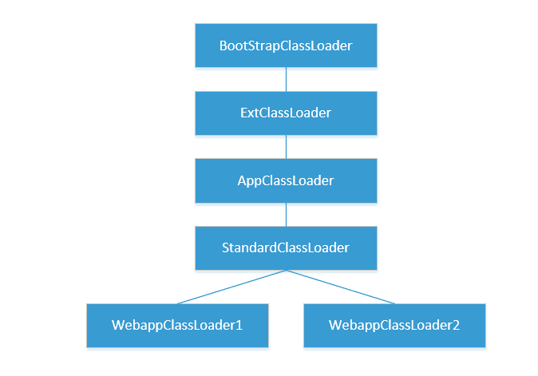
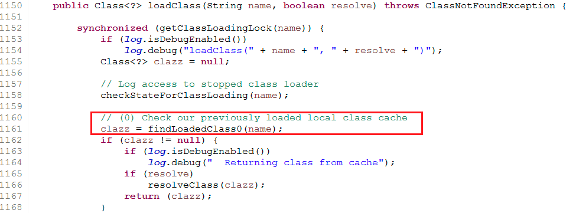
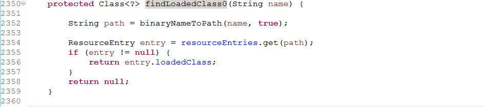
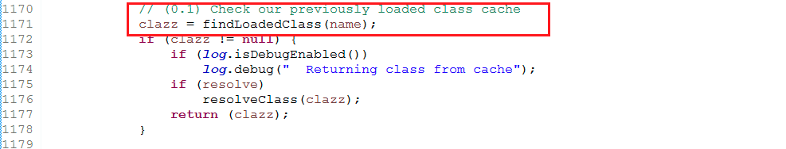
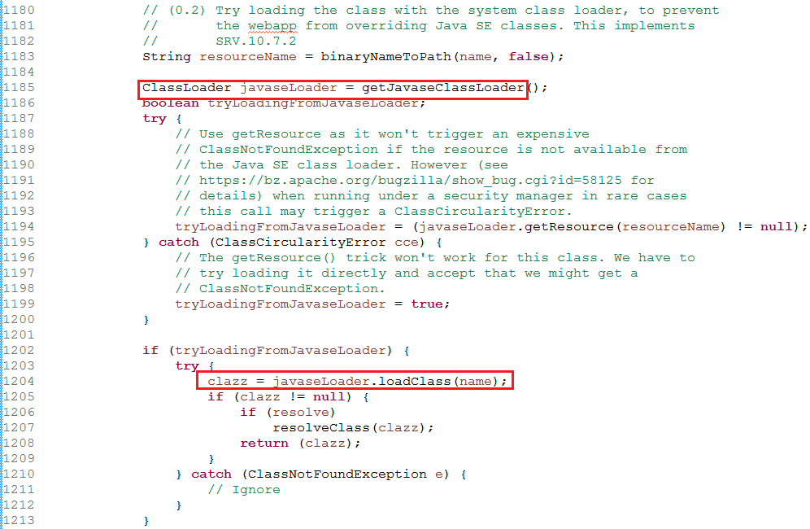
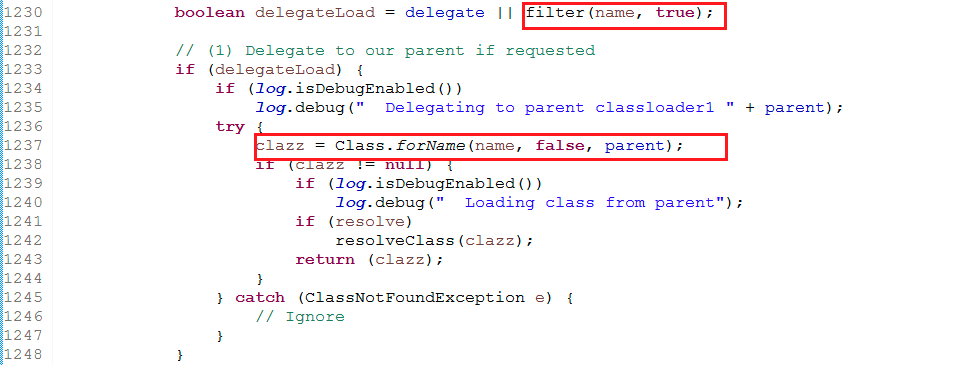
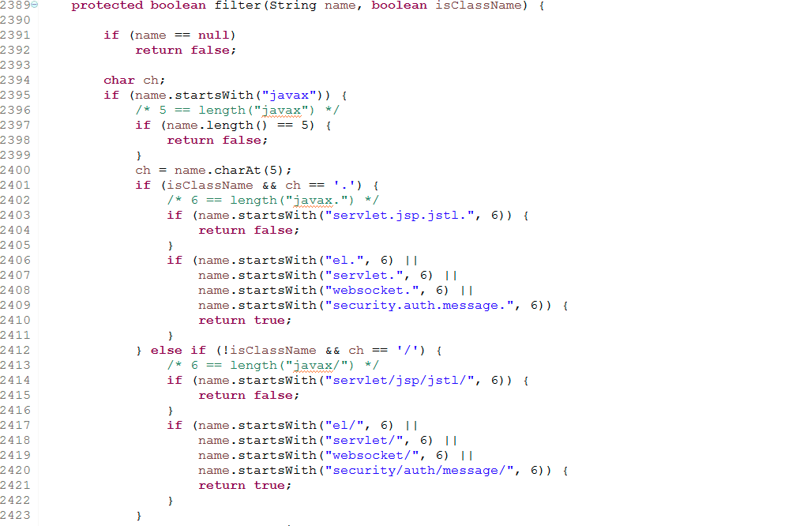
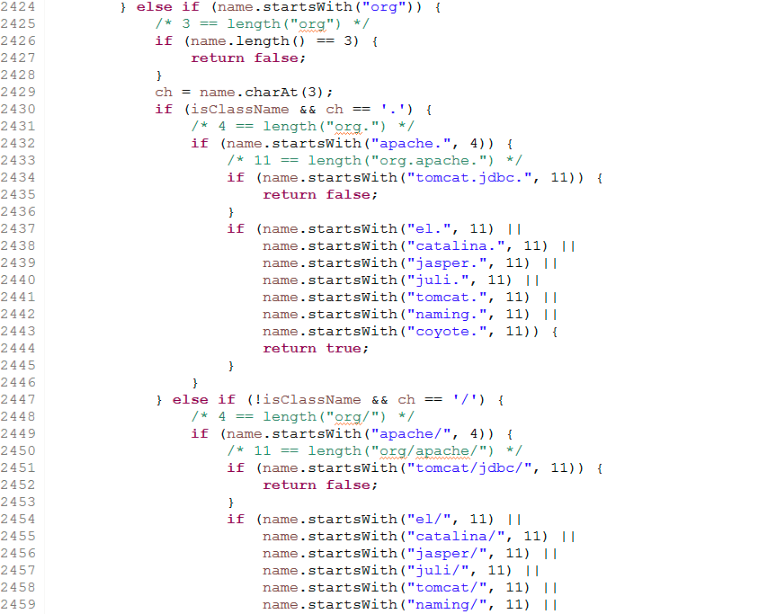
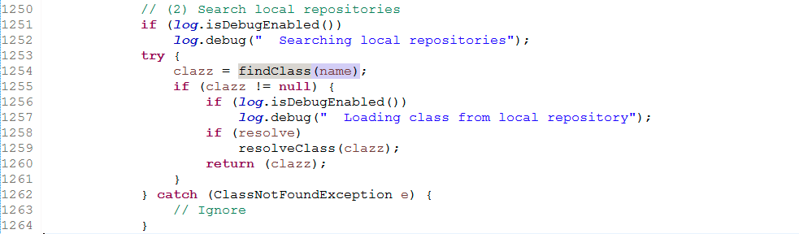
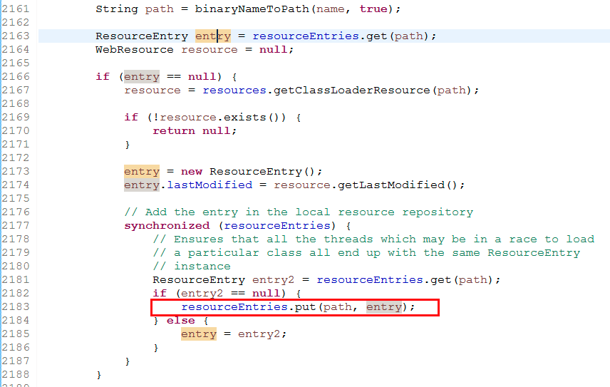

# Tomcat WebappClassLoader 类加载机制源码分析

JVM类加载机制参考：[JAVA程序运行原理分析](javacheng-xu-yun-xing-yuan-li-fen-xi.md)

## tomcat中的ClassLoader <a id="tomcat&#x4E2D;&#x7684;classloader"></a>



* 启动类加载器（BootStrap ClassLoader）：引导类装入器是用本地代码实现的类装入器，它负责将 jdk中jre/lib下面的核心类库或-Xbootclasspath选项指定的jar包加载到内存中。由于引导类加载器涉及到虚拟机本地实现细节，开发者无法直接获取到启动类加载器的引用，所以不允许直接通过引用进行操作。
* 扩展类加载器（Extension ClassLoader）：扩展类加载器是由Sun的ExtClassLoader（sun.misc.Launcher$ExtClassLoader）实现的。它负责将jdk中jre/lib/ext或者由系统变量-Djava.ext.dir指定位置中的类库加载到内存中。开发者可以直接使用标准扩展类加载器。
* 系统类加载器（System ClassLoader）：系统类加载器是由 Sun的 AppClassLoader（sun.misc.Launcher$AppClassLoader）实现的。它负责将系统类路径java -classpath或-Djava.class.path变量所指的目录下的类库加载到内存中。开发者可以直接使用系统类加载器。
* StandardClassLoader 负责加载tomcat容器相关的类
* WebappClassLoader 是每个web项目对应一个WebappClassLoader。这样做的目的是每个项目中都会有相同的类（package+classname），而类的内容不一样。这样每个项目一个WebappClassLoader可以达到隔绝项目类冲突的问题。

## WebappClassLoader的类加载机制

## 第一步 <a id="&#x7B2C;&#x4E00;&#x6B65;"></a>



首先调用findLoaderClass0\(\) 方法检查WebappClassLoader中是否加载过此类。



WebappClassLoader 加载过的类都存放在 resourceEntries 缓存中。

```text
protected final Map<String, ResourceEntry> resourceEntries =  new ConcurrentHashMap<>();
```

## 第二步 <a id="&#x7B2C;&#x4E8C;&#x6B65;"></a>



如果第一步没有找到，则继续检查JVM虚拟机中是否加载过该类。

调用ClassLoader的findLoadedClass\(\) 方法检查

## 

## 第三步



如果前两步都没有找到，则使用AppClassloader加载该类（也就是当前JVM的ClassPath）

## 第四步 <a id="&#x7B2C;&#x56DB;&#x6B65;"></a>



如果前三步都没找到，通过filter\(\) 方法检查该类是否在定义的包名下，如果在则通过 StandardClassLoader类加载。



## 

## 第五步



如果前4步都没有找到，将由WebappClassLoader来加载。

## 

从当前的工程的Web-INF/classes 目录下查找

如果找到，则创建ResourceEntry对象，保存这个类的元信息，并把他保存在WebappClassLoader的resourceEntries中，便于下次查找。

**本人简书blog地址：**[**http://www.jianshu.com/u/1f0067e24ff8**](http://www.jianshu.com/u/1f0067e24ff8)  
[**点击这里快速进入简书**](http://www.jianshu.com/u/1f0067e24ff8)

**GIT地址：**[**http://git.oschina.net/brucekankan/**](http://git.oschina.net/brucekankan/)  
[**点击这里快速进入GIT**](http://git.oschina.net/brucekankan/)

