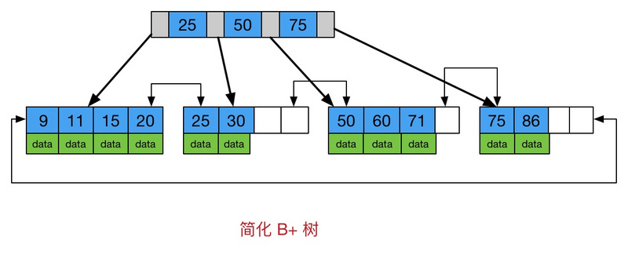

# B-/B+树看 MySQL索引结构

## B-树 

B-树,这里的 B 表示 balance\( 平衡的意思\),B-树是一种多路自平衡的搜索树.它类似普通的平衡二叉树，不同的一点是B-树允许每个节点有更多的子节点。下图是 B-树的简化图.

B-树有如下特点:

* 所有键值分布在整颗树中；
* 任何一个关键字出现且只出现在一个结点中；
* 搜索有可能在非叶子结点结束；
* 在关键字全集内做一次查找,性能逼近二分查找；

## B+ 树 

B+树是B-树的变体，也是一种多路搜索树, 它与 B- 树的不同之处在于:

* 所有关键字存储在叶子节点出现,内部节点\(非叶子节点并不存储真正的 data\)
* 为所有叶子结点增加了一个链指针

简化 B+树 如下图

## 为什么使用B-/B+ Tree 

红黑树等数据结构也可以用来实现索引，但是文件系统及数据库系统普遍采用B-/+Tree作为索引结构。MySQL 是基于磁盘的数据库系统,索引往往以索引文件的形式存储的磁盘上,索引查找过程中就要产生磁盘I/O消耗,相对于内存存取，I/O存取的消耗要高几个数量级,索引的结构组织要尽量减少查找过程中磁盘I/O的存取次数。为什么使用B-/+Tree，还跟磁盘存取原理有关。

### 局部性原理与磁盘预读 

由于磁盘的存取速度与内存之间鸿沟,为了提高效率,要尽量减少磁盘I/O.磁盘往往不是严格按需读取，而是每次都会预读,磁盘读取完需要的数据,会顺序向后读一定长度的数据放入内存。而这样做的理论依据是计算机科学中著名的局部性原理：

> 当一个数据被用到时，其附近的数据也通常会马上被使用  
> 程序运行期间所需要的数据通常比较集中

由于磁盘顺序读取的效率很高\(不需要寻道时间，只需很少的旋转时间\)，因此对于具有局部性的程序来说，预读可以提高I/O效率.预读的长度一般为页\(page\)的整倍数。

`MySQL(默认使用InnoDB引擎),将记录按照页的方式进行管理,每页大小默认为16K(这个值可以修改).linux 默认页大小为4K`

### B-/+Tree索引的性能分析 

> 实际实现B-Tree还需要使用如下技巧：
>
> 每次新建节点时，直接申请一个页的空间，这样就保证一个节点物理上也存储在一个页里，加之计算机存储分配都是按页对齐的，就实现了一个结点只需一次I/O。
>
> 假设 B-Tree 的高度为 h,B-Tree中一次检索最多需要h-1次I/O（根节点常驻内存），渐进复杂度为O\(h\)=O\(logdN\)O\(h\)=O\(logdN\)。一般实际应用中，出度d是非常大的数字，通常超过100，因此h非常小（通常不超过3）。
>
> 而红黑树这种结构，h明显要深的多。由于逻辑上很近的节点（父子）物理上可能很远，无法利用局部性，所以红黑树的I/O渐进复杂度也为O\(h\)，效率明显比B-Tree差很多。

## B-Tree和B+Tree中为什么优先选择B+Tree 

* B+树更适合外部存储,由于内节点无 data 域,一个结点可以存储更多的内结点,每个节点能索引的范围更大更精确,也意味着 B+树单次磁盘IO的信息量大于B-树,I/O效率更高。
* Mysql是一种关系型数据库，区间访问是常见的一种情况，B+树叶节点增加的链指针,加强了区间访问性，可使用在范围区间查询等，而B-树每个节点 key 和 data 在一起，则无法区间查找。

