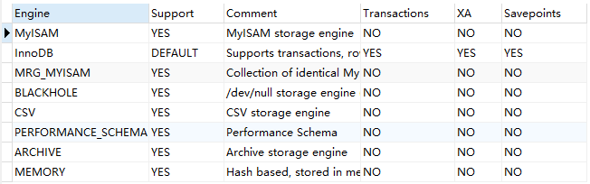
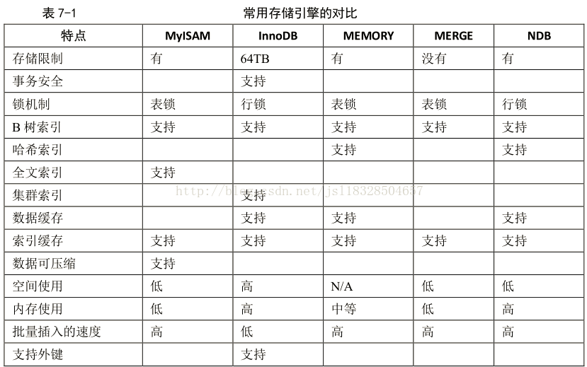

# 数据库存储的引擎分析

## 概述

      插件式存储引擎是 MySQL 数据库最重要的特性之一，用户可以根据应用的需要选择如何存储和索引数据、是否使用事务等。MySQL中的数据用各种不同的技术存储在文件（或者内存）中。这些技术中的每一种技术都使用不同的存储机制、索引技巧、锁定水平并且最终提供广泛的不同的功能和能力。通过选择不同的技术，你能够获得额外的速度或者功能，从而改善你的应用的整体功能。。MySQL 5.0 支持的存储引擎包括 MyISAM、InnoDB、BDB、MEMORY、MERGE、EXAMPLE、NDB Cluster、ARCHIVE、CSV、BLACKHOLE、FEDERATED 等，其中 InnoDB 和 BDB 提供事务安全表，其他存储引擎都是非事务安全表。可以先查看一下当前数据库可以使用的引擎。

## 存储引擎

存储引擎主要有： 1. MyIsam , 2. Mrg\_Myisam, 3. Memory, 4. Blackhole, 5. CSV, 6. Performance\_Schema, 7. Archive, 8. Federated , 9 InnoDB

> mysql&gt;show engin;
>
> 

## 存储引擎主要特征

* **MyIsam**

MyIsam 存储引擎独立于操作系统，也就是可以在windows上使用，也可以比较简单的将数据转移到linux操作系统上去。这种存储引擎在创建表的时候，会创建三个文件，一个是.frm文件用于存储表的定义，一个是.MYD文件用于存储表的数据，另一个是.MYI文件，存储的是索引。操作系统对大文件的操作是比较慢的，这样将表分为三个文件，那么.MYD这个文件单独来存放数据自然可以优化数据库的查询等操作。表可能会损坏，原因可能是多种多样的，损坏后的表可能不能访问，会提示需要修复或者访问后返回错误的结果。

MyISAM 类型的表提供修复的工具，可以用 CHECKTABLE 语句来检查 MyISAM 表的健康，并用 REPAIR TABLE 语句修复一个损坏的 MyISAM 表。表损坏可能导致数据库异常重新启动，需要尽快修复并尽可能地确认损坏的原因。其中MyIISAM的表又支持3中不同的存储格式，分别是：静态表（固定长度表），动态表，压缩表。

其中，静态表是默认的存储格式。静态表中的字段都是非变长字段，这样每个记录都是固定长度的，这种存储方式的优点是存储非常迅速，容易缓存，出现故障容易恢复；缺点是占用的空间通常比动态表多。静态表的数据在存储的时候会按照列的宽度定义补足空格，但是在应用访问的时候并不会得到这些空格，这些空格在返回给应用之前已经去掉。但是也有些需要特别注意的问题，如果需要保存的内容后面本来就带有空格，那么在返回结果的时候也会被去掉，开发人员在编写程序的时候需要特别注意，因为静态表是默认的存储格式，开发人员可能并没有意识到这一点，从而丢失了尾部的空格。  
动态表中包含变长字段，记录不是固定长度的，这样存储的优点是占用的空间相对较少，但是频繁地更新删除记录会产生碎片，需要定期执行OPTIMIZE TABLE 语句或 myisamchk -r 命令来改善性能，并且出现故障的时候恢复相对比较困难。  
压缩表由 myisampack 工具创建，占据非常小的磁盘空间。因为每个记录是被单独压缩的。

1. 不支持事务，但是并不代表着有事务操作的项目不能用MyIsam存储引擎，可以在service层进行根据自己的业务需求进行相应的控制。
2. 不支持外键。
3. 查询速度很快，如果数据库insert和update的操作比较多的话比较适用。
4. 对表进行加锁。
5. 对事务完整性没有要求或者以 SELECT、INSERT 为主的应用基本上都可以使用这个引擎来创建表
6. **Mrg\_Myisam**

Merge存储引擎，是一组MyIsam的组合，这些 MyISAM 表必须结构完全相同。也就是说，他将MyIsam引擎的多个表聚合起来，但是他的内部没有数据，真正的数据依然是MyIsam引擎的表中，但是可以直接进行查询、删除更新等操作。比如：我们可能会遇到这样的问题，同一种类的数据会根据数据的时间分为多个表，如果这时候进行查询的话，就会比较麻烦，Merge可以直接将多个表聚合成一个表统一查询，然后再删除Merge表（删除的是定义），原来的数据不会影响。

* **Memory**

Memory存储引擎使用存在内存中的内容来创建表。每个 Memory表只实际对应一个磁盘文件，格式是.frm。Memory类型的表访问非常得快，因为它的数据是放在内存中的，并且默认使用 HASH 索引，但是一旦服务关闭，表中的数据就会丢失掉。另外，要求存储的数据是数据长度不变的格式，比如，Blob和Text类型的数据不可用（长度不固定的）。

使用Memory存储引擎情况：

1. 目标数据比较小，而且非常频繁的进行访问，在内存中存放数据，如果太大的数据会造成内存溢出。可以通过参数max\_heap\_table\_size控制Memory表的大小，限制Memory表的最大的大小。
2. 如果数据是临时的，而且必须立即可用得到，那么就可以放在内存中。
3. 存储在Memory表中的数据如果突然间丢失的话也没有太大的关系。

> 【注】 Memory同时支持散列索引和B树索引，B树索引可以使用部分查询和通配查询，也可以使用&lt;,&gt;和&gt;=等操作符方便数据挖掘，散列索引相等的比较快但是对于范围的比较慢很多。

* **Blackhole**

“黑洞”存储引擎，他会丢弃所有的插入的数据，服务器会记录下Blackhole表的日志，所以可以用于复制数据到备份数据库。看其他的一些资料说：可以用来充当dummy master,利用blackHole充当一个“dummy master”来减轻master的负载，对于master来说“dummy master” 还是一个slave的角色，还有充当日志服务器等等。

* **CSV**

可以将scv文件作为MySql的表来使用，但是不支持索引。CSV引擎表所有的字段都必须为非空的，创建的表有两个一个是CSV文件和CSM文件。

* **Performance\_Schema**

MySQL5.5以后新增了一个存储引擎，就是Performance\_Schema，他主要是用来收集数据库服务器的性能参数。MySQL用户不能创建存储该类型的表。

他提供了以下的功能：

1. 提供进程等待的详细信息，包括锁、互斥变量、文件信息。
2. 保存历史的事件汇总信息，为Mysql服务器的性能做出详细的判断。
3. 对于新增和删除监控时间点都非常容易，并可以随意的改变Mysql服务器的监控周期

需要在配置文件my.cnf中进行配置才能开启。

* **Archive**

archive是归档的意思，仅仅支持插入和查询两种功能，在MySQL5.5以后支持索引功能，他拥有很好的压缩机制，使用zlib压缩库，在记录请求的时候实时的进行压缩，经常被用来作为仓库使用。适合存储大量的独立的作为历史记录的数据。拥有很高的插入速度但是对查询的支持较差。

* **Federated**

Federated存储引擎是访问MySQL服务器的一个代理，尽管该引擎看起来提供了一个很好的跨服务器的灵活性，但是经常带来问题，默认是禁用的。

* **InnoDB**

InnoDB是一个事务型的存储引擎，提供了具有提交、回滚和崩溃恢复能力的事务安全。但是对比 MyISAM的存储引擎，InnoDB 写的处理效率差一些并且会占用更多的磁盘空间以保留数据和索引有行级锁定和外键约束，适用于以下的场合：

1. 更新多的表，适合处理多重并发的更新请求。
2. 支持事务。
3. 可以从灾难中恢复（通过bin-log日志等）。
4. 外键约束。只有他支持外键。
5. 支持自动增加列属性auto\_increment。
6. 存储方式

> * 使用共享表空间存储，这种方式创建的表的表结构保存在.frm 文件中，数据和索引保存在 innodb\_data\_home\_dir 和 innodb\_data\_file\_path 定义的表空间中，可以是多个文件。
> * 使用多表空间存储，这种方式创建的表的表结构仍然保存在.frm 文件中，但是每个表的数据和索引单独保存在.ibd 中。如果是个分区表，则每个分区对应单独的.ibd文件，文件名是“表名+分区名”，可以在创建分区的时候指定每个分区的数据文件的位置，以此来将表的 IO 均匀分布在多个磁盘上。

